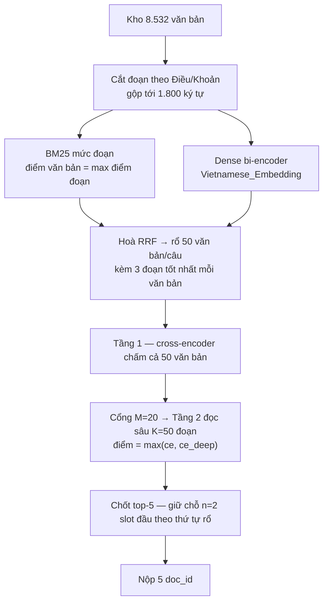

# project_DSC — Truy hồi văn bản pháp luật tiếng Việt (DSC 2026, Task 1)

Hệ thống tra cứu văn bản pháp luật: cho một câu hỏi, tìm văn bản chứa câu trả lời
trong kho **8.532 văn bản**.

> ### ⚠️ Cập nhật 09/2026 — độ đo chính là **Precision**, không phải Recall@5
>
> Email BTC ngày 02/08 xác định *"Precision là độ đo chính"*, trái với tài liệu mô tả
> dữ liệu. Đã xác minh bằng thực nghiệm: bộ chấm chia precision cho **số id thực nộp**,
> nên bài nộp tối ưu là **1 id mỗi câu**, không phải 5.
>
> **Bài nộp hiện tại: `precision 0,711` · hạng 3/84.** Toàn bộ phần dưới của README này
> mô tả giai đoạn tối ưu `Recall@5` (kết thúc ở LB 0.9124, 30/08) — vẫn đúng về mặt lịch
> sử và mọi phép đo trong đó vẫn dùng được, nhưng **kết luận "reranker teo lại" chỉ đúng
> ở k=5 và sai hẳn ở k=1**: đo ở hạng 1, `max(ce, ce_deep)` = 0,7100 so với thứ tự rổ
> 0,5933, tức bộ chấm hơn rổ **+11,67 điểm**.
>
> Đường chạy đầy đủ của bài nộp hiện tại: **[`REPRODUCE.md`](REPRODUCE.md)**.

> *Vietnamese legal document retrieval. Two-stage pipeline: hybrid retrieval
> (chunk-level BM25 ⊕ dense bi-encoder, fused with RRF) → cross-encoder reranking with
> deep chunk reading → slot-reservation blending. Public LB 0.9124. Reports in `docs/`
> are in Vietnamese.*

**Public LB: precision 0,711 (hiện tại) · recall@5 0,9124 (giai đoạn trước).** Đây là
phần **xếp hạng & chốt đáp án** của hệ thống (thành viên E); khâu sinh ứng viên do một
thành viên khác phụ trách.

---

## Kết quả — từng bước một

Mỗi dòng là một thay đổi, đo trên public leaderboard:

| bước | LB | Δ |
|---|---|---|
| cross-encoder xếp hạng thuần | 0.8350 | — |
| + giữ chỗ 2 slot cho thứ tự rổ | 0.8573 | **+2,23** |
| + đọc sâu nhiều đoạn mỗi văn bản (M=20, K=20) | 0.8840 | **+2,67** |
| + chọn đoạn bằng BM25 mức đoạn, gộp 1.800 ký tự | 0.8871 | +0,31 |
| + đổi rổ ứng viên sang **hoà RRF** (BM25 ⊕ dense) | 0.9063 | **+1,92** |
| + M=10 → M=20 | 0.9109 | +0,46 |
| + rổ dùng model nhúng khớp với reranker | 0.9118 | +0,09 |
| + K=20 → K=50, giữ chỗ n=2 | **0.9124** | +0,06 |

**Hai đòn lớn nhất đều là đổi *thứ nạp vào*, không phải tinh chỉnh cái đang có.**
Đọc sâu (+2,67) và đổi rổ ứng viên (+1,92) cộng lại lớn hơn toàn bộ phần vặn tham số
của cả dự án.

## Pipeline



**Ba tham số đáng nhớ.** `M` = lấy bao nhiêu **văn bản** đầu bảng để đọc sâu ·
`K` = với mỗi văn bản đó, chấm bao nhiêu **đoạn** · `n` = giữ bao nhiêu slot đầu của
đáp án theo thứ tự rổ thay vì theo bộ chấm.

## Phát hiện đáng kể nhất: rổ tốt lên thì reranker teo lại

Trên 300 câu dev, đếm trực tiếp bộ chấm so với thứ tự rổ thô:

| | số câu |
|---|---|
| rổ xếp văn bản đúng ngoài top-5, bộ chấm **kéo vào được** | 14 |
| rổ xếp văn bản đúng trong top-5, bộ chấm **đẩy ra** | **22** |
| **ròng** | **−8 câu** |

Nộp thẳng 5 văn bản đầu rổ, không chấm lại gì, được **0,9117**. Chấm lại đầy đủ bằng
cross-encoder 568 triệu tham số được **0,9100** — *kém hơn*. Không phải bộ chấm yếu:
mỗi câu nó cứu được thì làm hỏng 1,6 câu. Đó là lý do quy tắc chốt top-5 ở đây là
**giữ chỗ** (khoanh vùng thiệt hại vào đúng `5−n` slot) chứ không phải gộp điểm
(bôi ảnh hưởng của bộ chấm lên cả 5 slot). Giữ chỗ thắng z-score, min-max và RRF
hai thứ hạng ở **mọi** tham số đã quét.

## Cấu trúc repo

```
src/         15 module Python — cắt đoạn, chọn đoạn, chấm, chốt top-5, đo đạc
notebooks/   25 notebook Kaggle, mỗi cái một lượt thí nghiệm
docs/        báo cáo kỹ thuật + nhật ký + bảng đối chứng model
results/     số liệu đủ để tái hiện MỌI phân tích trong docs/ trên CPU
data/        trống — xem data/README.md
```

⚠️ **Trên Kaggle, mọi file trong `src/` được upload PHẲNG vào một dataset rồi
`sys.path.append`.** Cấu trúc thư mục ở đây chỉ để đọc cho dễ; notebook import theo
tên module (`from deep_chunk import ...`), không theo đường dẫn `src/`.

**Điểm vào chính:**

| file | việc |
|---|---|
| `src/deep_chunk.py` | cắt đoạn, `pick_chunks` (chọn K đoạn bằng BM25 trong phạm vi văn bản), `deepen_all` |
| `src/rerank_from_d.py` | chấm ứng viên, `blend_bm25_first` (quy tắc giữ chỗ) |
| `src/metrics.py` | `Recall@k` / `Precision@k` đúng công thức BTC, kèm 10 test bắt lỗi âm thầm |
| `src/rerank_qwen.py` | chạy reranker kiểu decoder, đếm tham số thật dưới lượng tử hoá 4-bit |
| `notebooks/public_ft_run.ipynb` | **lượt chạy sinh ra bài nộp hiện tại** (precision 0,711) |
| `notebooks/finetune_listwise_run.ipynb` | tinh chỉnh listwise — hiệu ứng dương duy nhất sống sót khi ra bảng thật |
| `src/build_trainset.py` | dựng tập huấn luyện listwise (âm hạng 10–20) |
| `src/k_tran.py` | đo trần trục `k` trên CPU + đủ bộ cổng kiểm bài nộp |
| `notebooks/fusion_v3_run.ipynb` | lượt chạy sinh ra bài nộp của giai đoạn Recall@5 |

## Tái hiện phân tích — không cần GPU

Toàn bộ số liệu trong `docs/` dựng lại được từ `results/` trong vài giây:

```bash
pip install -r requirements.txt
python - <<'PY'
import json
sc = json.load(open('results/dev300/scores_dev300_moc_k3.json'))
ro = json.load(open('results/dev300/order_dev300_matchEmb.json'))

def chot(sc_q, ro_q, n, k=5):
    """Giữ chỗ n slot đầu cho thứ tự rổ, phần còn lại theo bộ chấm."""
    xep, out = sorted(sc_q, key=lambda d: -sc_q[d]), []
    for d in list(ro_q[:n]) + xep + list(ro_q):
        if d not in out: out.append(d)
        if len(out) >= k: break
    return out[:k]

print(chot(sc['29410'], ro['29410'], n=3))
PY
```

Muốn ra được điểm thì cần nhãn — xem `data/README.md`.

## Những hướng đã thử và THẤT BẠI

Phần này có lẽ hữu ích hơn phần thành công. Mỗi dòng là một phép đo đã trả tiền bằng
giờ GPU, không phải phỏng đoán.

| hướng | kết quả đo được |
|---|---|
| Tinh chỉnh toàn phần cross-encoder (2 lần) | **−0,50** rồi **−6,50** điểm |
| Chưng cất từ model 8B | ròng −16 nhóm/600. **Thầy (0,5417) thua trò (0,5683)** |
| Học lại đầu phân loại, đóng băng encoder | Δ tốt nhất +0,67; 18 câu sai → vẫn 18 câu sai |
| Ensemble nhiều bộ chấm / trộn hai pipeline | âm ở mọi trọng số |
| Gộp điểm z-score / min-max / RRF ở khâu chốt | thua quy tắc giữ chỗ ở **mọi** tham số |
| Chọn `n` thích nghi theo từng câu | trần oracle chỉ +1,17 → dưới sàn nhiễu |
| Ưu thế theo loại văn bản / năm ban hành / thẩm quyền | âm, **kể cả khi ước tham số ngay trên chính tập dev** |
| Ưu tiên văn bản mới nhất | gold là văn bản mới nhất đúng 2,0% = ngẫu nhiên |
| Ghép tên văn bản vào truy vấn | slug không dấu −2,0; tiêu đề có dấu +1,00 nhưng 83% trùng tín hiệu sẵn có |
| Nâng `K` 20→50 | 14,8 giờ GPU cho **+0,06 điểm** |
| Hạ `K` 50→20 hoặc →10 | trần chỉ ~17 câu/1000 — dưới sàn nhiễu |
| Nhét điểm BM25 vào input cross-encoder ([ECIR 2023](https://arxiv.org/abs/2301.09728)) | 53,7% trên tập cần cứu = **tung xu** |
| Negative hạng 2–10 thay vì 10–20 khi tinh chỉnh | thắng 4 · thua 4 · **hoà 4** trên 12 ô |
| Khớp thẩm quyền / phạm vi pháp lý | trần 1,60 điểm, và thứ bậc trỏ **ngược dấu** |
| **Bộ phân xử cặp** (pairwise judge) | dev300 **+2,33 (p<0,05)** → LB **−1,4** |

### Quy luật quan trọng nhất: cái gì CHUYỂN được từ tập dev sang tập thi

| can thiệp | bản chất | tập dev | **tập thi thật** |
|---|---|---|---|
| cộng RRF vào điểm | **phân xử top-2** | +0,6…+2,3 | **−0,9** |
| `replace` thay `max` | **phân xử top-2** | −2,00 | **−3,1** |
| bộ phân xử cặp | **phân xử top-2** | **+2,33** (p<0,05) | **−1,4** |
| tinh chỉnh listwise | **đổi hàm chấm** | +1,4…+1,9 | **+1,0** ✅ |

> **Mọi can thiệp vào *quyết định* hạng 1 vs hạng 2 đều không chuyển được. Can thiệp vào
> *hàm chấm* thì chuyển được.** Ba lần trên ba lần — kể cả khi vượt ngưỡng ý nghĩa thống kê
> đã khoá trước khi chạy.

Đây là kết quả âm đáng giá nhất của dự án: nó đóng cả một *họ* phương pháp (bộ phân xử cặp,
thang Elo, MLP đặc trưng, khớp phạm vi) bằng bốn điểm dữ liệu, chứ không phải đóng từng cái một.
Chi tiết: [`docs/HUONG_DA_DONG.md`](docs/HUONG_DA_DONG.md).

**Vì sao tinh chỉnh hỏng** (chẩn đoán, không phải "không làm được"): negative lấy từ
BM25 top-20 là **khó nhất có thể** — trong kho pháp luật, top-20 đầy văn bản trả lời
được câu hỏi nhưng không được gán nhãn. Dạy máy "những cái đó SAI" là dạy điều không
đúng. Cộng thêm nhãn dương chọn bằng BM25 chỉ đúng 33%.

## Vài bài học phương pháp

1. **Luôn in kèm dòng "rổ trần, không chấm lại".** Cấu hình đang đo còn thua dòng đó
   thì dừng, đừng đọc Δ. Một dòng code — đã cứu 3 giờ GPU và cả một nhánh nghiên cứu.
2. **So sánh phải GHÉP CẶP.** Cùng tập câu, chỉ đổi một tham số → chỉ câu *bất đồng*
   mang thông tin. Sai số không ghép cặp là 1,30 điểm; ghép cặp (McNemar) đọc được
   hiệu ứng +2,33 ở p = 0,039. **Cùng dữ liệu, mạnh hơn ~3 lần, 0 giờ GPU.**
3. **Đo trần trước khi chạy.** Oracle chạy trên CPU vài giây và cho biết trần tuyệt
   đối của hướng đang định thử — đã đóng ba hướng lớn trước khi tiêu một giờ GPU nào.
4. **Kiểm chồng lấn trước khi cộng dồn.** Đọc sâu, ghép tiêu đề, rổ tốt hơn, chấm lại
   — bốn "giải pháp" này sửa *cùng* một nhóm câu. Đo riêng thì cái nào cũng dương,
   gộp lại thì không cộng được.
5. **Ước chi phí bằng SỐ ĐOẠN, đếm cho đúng cấu hình sắp chạy.** Một lần bắc cầu qua
   con số của cấu hình khác đã cho ra ước 6,9 giờ trong khi thực tế là 14,8 giờ.
6. **Tên repo model không đáng tin — phải đếm tham số thật.** Dưới lượng tử hoá NF4,
   `sum(p.numel())` báo chưa tới một nửa số thật.

Đầy đủ trong `docs/NHAT_KY_KY_THUAT.md`.

## Tài liệu

| file | nội dung |
|---|---|
| `docs/BaoCao_TomTat_Retrieval_Khim.docx` | 4 trang — phương pháp và các hướng đã thử, kèm kết quả nhanh |
| `docs/BaoCao_ChiTiet_Retrieval_Khim.docx` | 15 trang — giao thức đo, tham số, số liệu, bẫy đã dính |
| `docs/pipeline_loi_DSC.html` | sơ đồ pipeline + bảng phân tích điểm mất theo nguyên nhân |
| `docs/bang_ablation.md` | đối chứng 10 cross-encoder trên **cùng 15.000 cặp** |
| **`CLAUDE.md`** | **nguồn sự thật, ~1.820 dòng** — mọi kết luận kèm phép đo đứng sau nó, 12 quy tắc phương pháp, 8 bẫy kỹ thuật, toàn bộ lịch sử quyết định |
| `docs/HUONG_DA_DONG.md` | sổ kết quả âm — bản cô đọng của `CLAUDE.md`, đọc được cho người ngoài |
| `docs/CLAUDE_LUUTRU_den_28-08.md` | nhật ký chi tiết 12–28/08 (~4.000 dòng) |
| `docs/NHAT_KY_KY_THUAT.md` | nhật ký kỹ thuật — mọi kết luận kèm phép đo đứng sau nó |

**Một kết quả từ bảng đối chứng:** số tham số không dự đoán được chất lượng.
`mmarco-mMiniLMv2` (0,118B) đạt R@5 0,7217, hơn `ViRanker` (0,568B, 0,6867) tới
**+3,50 điểm** dù nhỏ hơn 4,8 lần và nhanh hơn 16 lần. Thứ quyết định là dữ liệu
huấn luyện tiếng Việt/pháp lý, không phải kích thước.

## Không có gì trong repo này

- **Kho văn bản và tập câu hỏi của BTC** — không tái phát tán. Xem `data/README.md`.
- **Mọi tạo phẩm chứa dự đoán trên đề thi** (`scores_public_*`, `order_public_*`,
  các file bài nộp). Cuộc thi chưa kết thúc; công khai dự đoán đề thi là đưa đáp án
  cho người khác. Sẽ bổ sung sau khi kết thúc nếu thể lệ cho phép.
- **Vector đã nhúng** (`.npy`, 52 MB) và các rổ ứng viên (207 MB mỗi file) — quá lớn
  cho git, dựng lại được từ mã nguồn.
